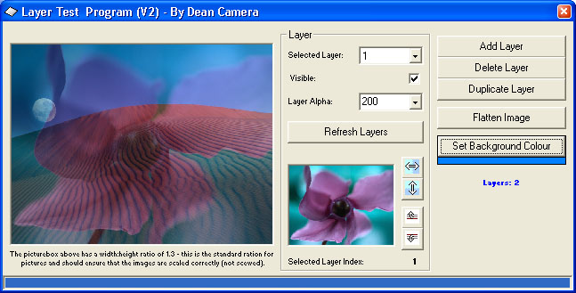



## Photoshop\-like Layers Demo 2 \(UPDATED 11th Oct 2005\)

### Description

This is version 2 of my "Photoshop-like layers demo" project which I submitted last month (and which was very well recieved). This version fixes some bugs and adds new feautres (such as the layer flip, merge, duplicate and move buttons). I also added in the SetStretchBlt command to make the preview picturebox show the correct colours, as you can no doubt see. Each layer can have an individual transparency level and be moved seperatly, although the moving speed will decrease each time a new layer is added. Tested and works fine on Win 2000/XP and should work fine on 98/ME (NOT 95). Comments appreciated. *** Updated 14th Oct 2005: Now has demo for drawing onto a layer with the mouse, and Invert Layer function added.
 
### More Info
 

             |
---                |---
**Submitted On**   |2005-10-11 19:08:28
**By**             |[Dean Camera](https://github.com/Planet-Source-Code/PSCIndex/blob/master/ByAuthor/dean-camera.md)
**Level**          |Intermediate
**User Rating**    |5.0 (50 globes from 10 users)
**Compatibility**  |VB 6\.0
**Category**       |[Graphics](https://github.com/Planet-Source-Code/PSCIndex/blob/master/ByCategory/graphics__1-46.md)
**World**          |[Visual Basic](https://github.com/Planet-Source-Code/PSCIndex/blob/master/ByWorld/visual-basic.md)
**Archive File**   |[Photoshop\-19401010142005\.zip](https://github.com/Planet-Source-Code/dean-camera-photoshop-like-layers-demo-2-updated-11th-oct-2005__1-60851/archive/master.zip)

